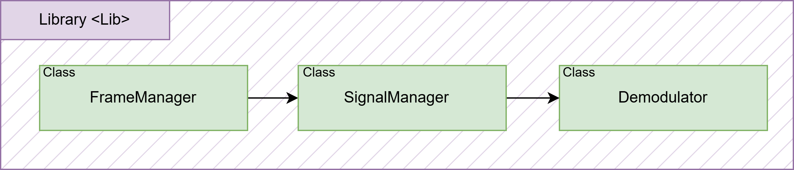
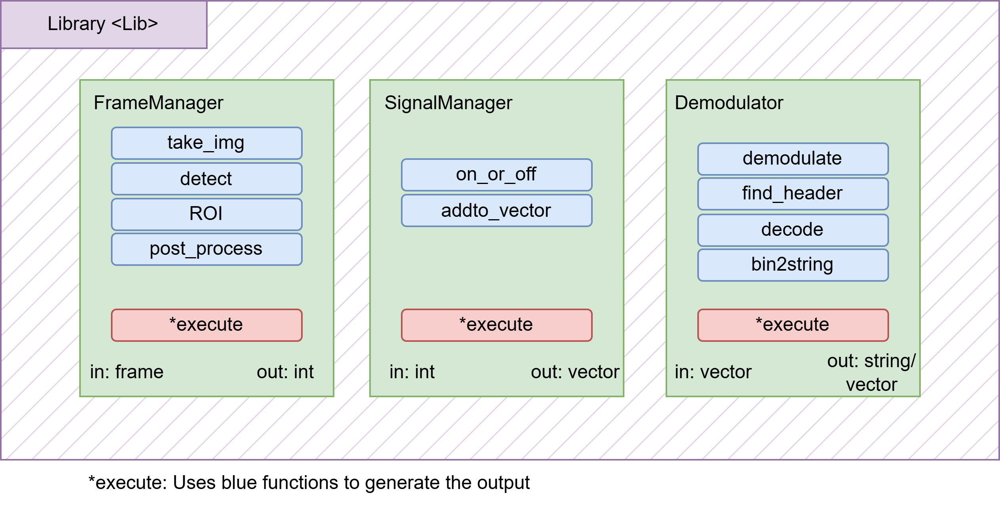
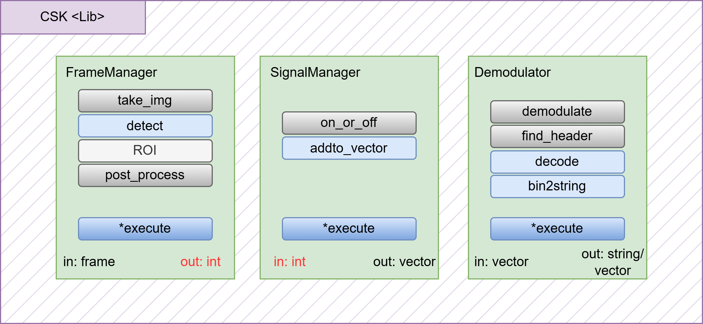

# Use of C++ functions
***
## Section index
1. [Introduction](#introduction)
2. [Overall structure](#overall-structure)
3. [Example](#how-to-design-a-module)
***
## Introduction
The platform is implemented in a modular fashion, this with the idea of allowing the user to only edit whatever part they want to test easily without breaking the system. For this reason the code is composed in modules where the input and output is defined, with specific functions in each part that are common in a OCC system. 

> **_NOTE:_** 
Of course, if a different structure of code can be implemented (and recommended for user with more experience with JNI and C++), for both the C++ section or the JNI as long as the input and output structure of the Android App is correctly designed.

## Overall structure
The main code is composed by three classes wrapped under a namespace, this to allow the user to only modify the library inclusion and the prefix of the functions:
```cpp
# Function code
namespace NAME {
    ...
}

# main
#include "function.hpp"
...

NAME::FrameManager fm(c);
```
At the same time, the three classes are made to not interact directly between each other besides receiving the output of another, and making it possible to use the both for live or recorded videos. The clases are:

* **FrameManager:** Only handles and preprocesses images
* **SignalManager:** Transforms images into raw signals
* **Demodulator:** Demodulates, decodes and sychronizes signals

Their interaction is as shown below:


Meaning that they are intended to operate linearly in order to get the desired output of the system, that way, in the end, a common structure can be made for most systems:




## How to design a module 
Let's suppose we start from the example code in the app for prerecorded video, wich is OOK modulation with a predetermined ROI, and we want to use CSK with a different detection system, the modules we would have to edit are remarked in blue.


The first step is to then duplicate both the header file and the code file of the example, therefore having:
```
- include
    -ook.hpp
    -csk.hpp
- src
    -ook.hpp
    -csk.hpp
    -main.hpp
```
Then, modify the namespace definition in the header file, replacing `OOK` with `CSK` and the `#ifndef` name, the namespace also need to be modified in the `.cpp` file. After that, we can proceed to edit the functions we need to edit, as well as editing the output.

* **FrameManager**
    * **FrameManager::detect** stops being a unused function, and now a propper detection of the ROI is implemented, receiving the frame and returning coordinates of our transmitter.
    * **FrameManager::post_process** No longer needs to binarize and use functions like erosion, instead it should return the average color in the region of interest (represented in a 1x3 array).
    * **FrameManager::execute** need to include the detect function, following this order: &#8594;_take_img_ &#8594; _detect_ &#8594; _ROI_ &#8594; _post_process_. Where the output definition alse needs to be modified.

* **SignalManager**
    * **SignalManager::on_or_off** is no longer needed, since 

