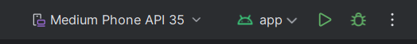
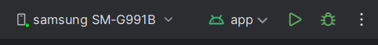

# CameraXApp base user #

***
## Section Index
1. [Introduction](#introduction)
2. [Core files](#core-files)
***

# Introducción
This section is for users that want to use the base implementation of CameraXApp to do experiments with the objective of studying the impact of different parameters and enviromental variables such as:

* Tx-Rx distance
* Enviroment brightness
* Device movement
* Transmitter led intensity
* Higher trasmition rates
* Light anchors impact
* Trasmitter led size 
* Video resolution/quality

# Core files

The main core file to modify easily parameters from the app is the core_values.xml file with the following path:

```
├───app  
    └───src
        └───main
            └───res
                └───values
                    └─── core_values.xml
```

where you have the following structure

``` xml
<?xml version="1.0" encoding="utf-8"?>
<resources>
    <integer name="VideoQuality">2</integer> <!-- From 1 to 4 from FHD,HD,SD,LOWEST -->
    <integer name="PreviewWidth">1280</integer> <!-- Check in Camera2Probe your supported res-->
    <integer name="PreviewHeight">720</integer> <!-- Check in Camera2Probe your supported res -->
    <integer name="TopFps">30</integer> <!-- Set the same as BottomFps if you want a fixed fps -->
    <integer name="BottomFps">30</integer> <!-- Set the same as TopFps if you want a fixed fps -->
    <!-- Consider that even if you fix the frame rate if the quality is to high it may drop
     based on the phone capacity and the hardware performance limits  -->
    <string name="DefaultScreenMessage">Record or select an experiment to see its information</string>
</resources>
```

Once all the setup is done, enable the USB debugging option from your phone, connect it to the PC with the program and accept the USB debugging from the phone for Android Studio to detect it. After that there will be a change in the upper section from lets say a Pixel phone to your phone, then you can run play and the app will be compiled and loaded to your device for you to use.



Integrated simulator run



External Android device run

On how to navigate through the app, here is a [Simple video](https://youtu.be/_-x7ndFNTsU) on how to retrieve the demodulated output from a experiment from the device ([Link](https://youtu.be/qw1MK24rZjw)).